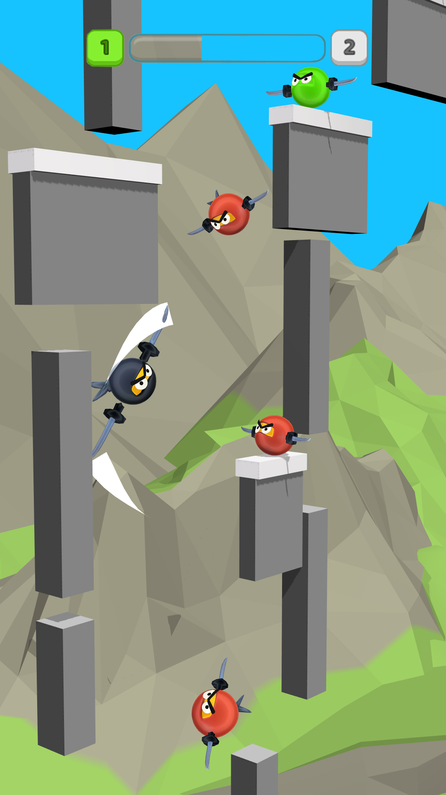

  <!-- MAIN HEAD -->
  <h1>Mobile prototypes </h1>
  <h4>  </h4>
  <!-- Content -->
  <table>
    <tbody align="center">
      <tr>
        <!-- column 1 -->
        <th width="350px"> 
          <a href="https://youtube.com/shorts/IiTsqjVfT7U?feature=share" target="_blank">
            
            Click to watch a video
          </a>
        </th>
        <!-- column 2 -->
        <td width="650px">
          <h4>AsteroidPirate!</h4>
          
👉- Movement mechanics on a sphere

          
👉- Sheep collecting mechanics

          
👉- Enemy mechanics (turrets that shoot and bombs that follow the player)

        </td>
      </tr>
    </tbody>
    <tbody align="center">
      <tr>
        <!-- column 1 -->
        <th width="350px"> 
          <a href="https://youtube.com/shorts/f5EdHb_fP4Y?feature=share" target="_blank">
            
            Click to watch a video
          </a>
        </th>
        <!-- column 2 -->
        <td width="650px">
          <h4>WaterHarvest</h4>
          
👉 - Shop UI window

          
👉 - Upgrade resource

          
👉 - Label displaying the resource with the lowest price

        </td>
      </tr>
    </tbody>
     <tbody align="center">
      <tr>
        <!-- column 1 -->
        <th width="350px"> 
          <a href="https://youtube.com/shorts/DOg7GjEDE70" target="_blank">
            
            Click to watch a video
          </a>
        </th>
        <!-- column 2 -->
        <td width="650px">
          <h4>NinjaClimber</h4>
          
👉- mechanics of jumping and piercing with a blade
          
👉- enemy mechanics

        </td>
      </tr>
     </tbody>
  </table>

  <!-- SECOND HEADER BELOW THE TABLE -->
  <h2>PC Games</h2>

